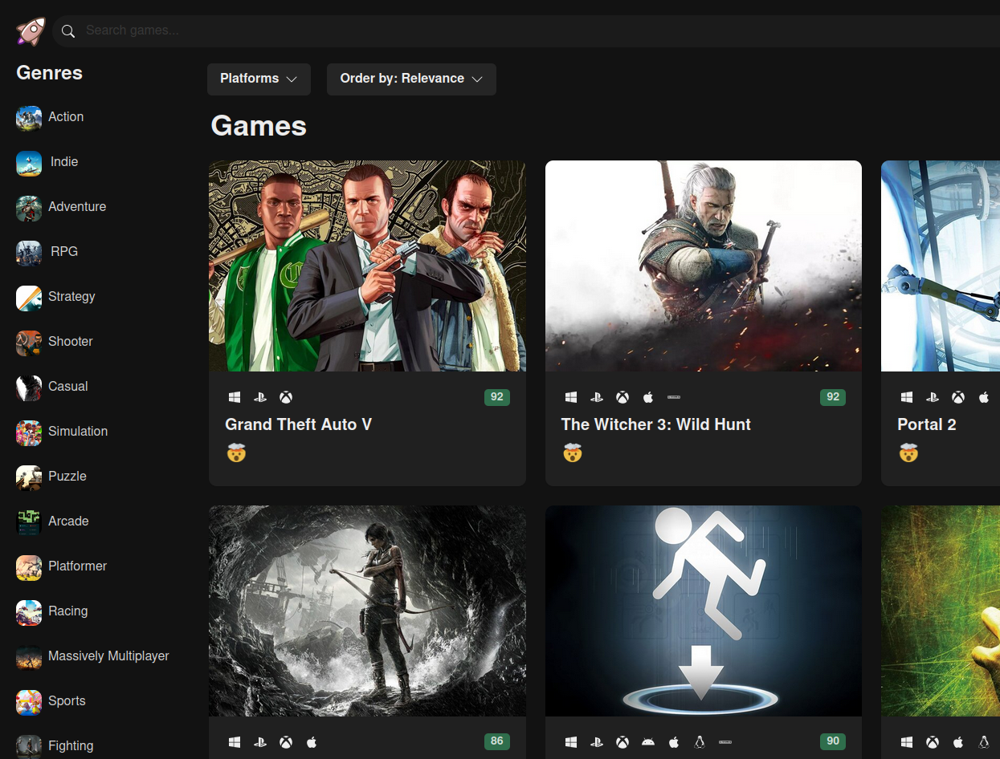
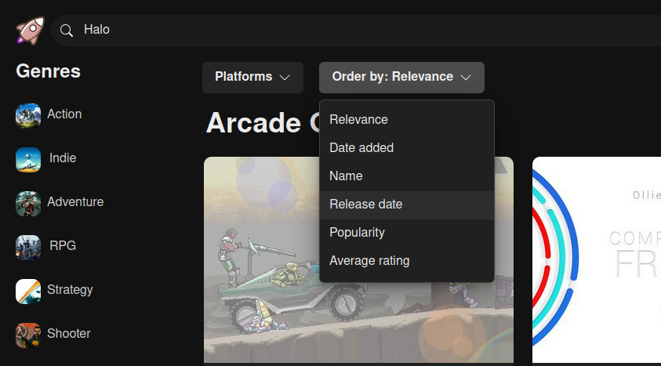
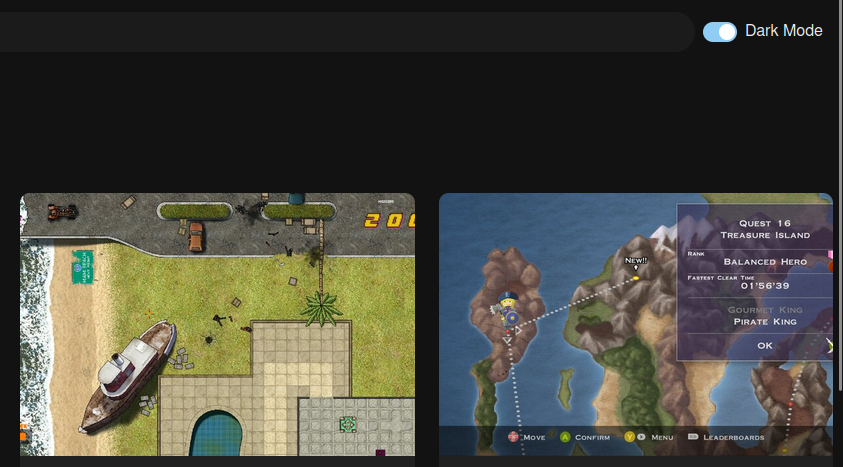
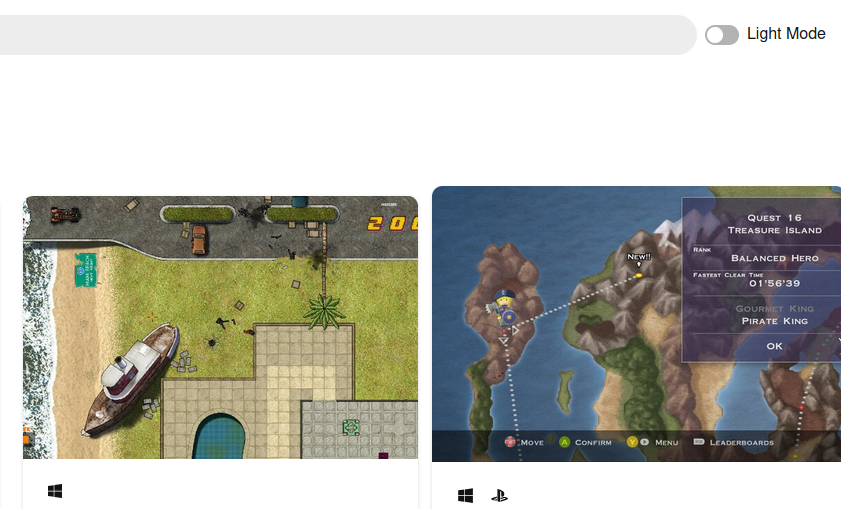

### Game Library demo

A game library demo app, made as an exercise. Its written in typescript upon React framework. 
The frontend fetches the data from an external API and offers a few options for filtering while searching games. It also has a responsive (adaptive) and dark/light layout.

 

